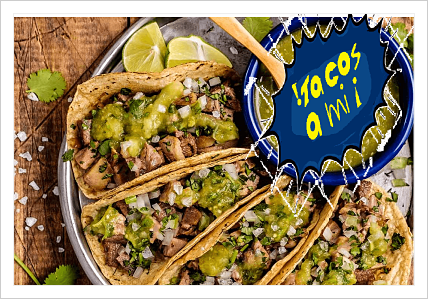
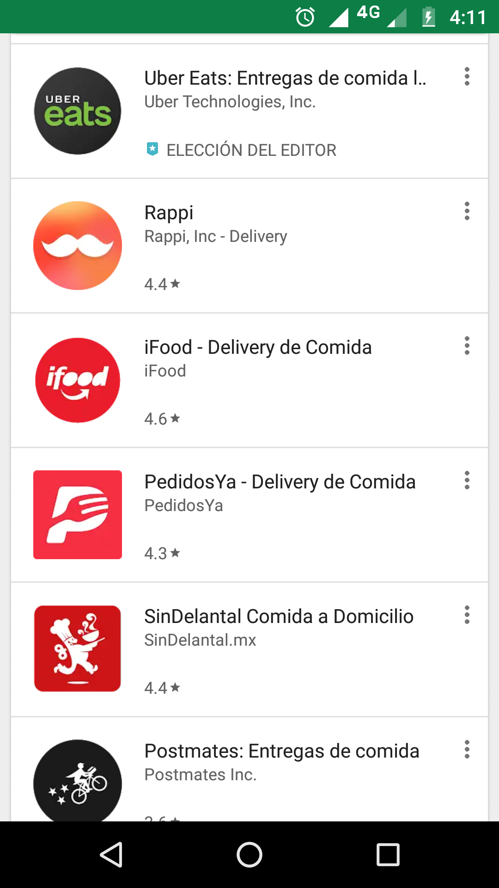

#  !Tacos a mi ¡

##¿Sabias que la UNESCO ha nombrado al "TACO" Patrimonio Cultural?:
“Hoy por hoy no podemos hablar de México sin relacionarlo con los tacos. Como ciudadana extranjera me costó mucho trabajo entender la importancia cultural que tienen este platillo en los mexicanos. No solo es parte fundamental de su gastronomía, los tacos se han convertido en un estilo de vida que incluso llega a definir la personalidad de los habitantes. Es algo muy complejo de entender porque en ninguna otra parte del mundo la comida se convierte en un cómplice y amigo de los ciudadanos como los tacos en su país. Para asimilar la importancia de este alimento tuve que viajar a México y vivir 3 meses, en ese lapso entendí que el taco es un personaje tan importante que incluso llega a definir la personalidad de sus ciudadanos”, señaló - La directora de la UNESCO, Irina Bokova.

## ¡Si amas ser mexican@ y  amas tu cultura ,esta app es para ti!

### Te mostraremos los mejores  tacos de la ciudad ,para que puedas saborear tu deliciosa cultura.

## Para poder crear esta pagina ,se ha realizado un estudio de mercado para ver las aplicaciones existentes.

Nombre de la app  |           Rappi      |
-------------     | ---------------------|
Nombre app mobile |Rappi                 |
Pais de Origen    |Colombia              |
Selección Idiomas |si                    |
Interactiva       |si                    |
Intuitiva         |si                    |
Gratuita          |si                    |
web               |si                    |
mobil             |si                    |

Nombre de la app  |         Uber Eats    |
-------------     | ---------------------|
Nombre app mobile |Uber Eats             |
Pais de Origen    |San Francisco         |
Selección Idiomas |si                    |
Interactiva       |si                    |
Intuitiva         |si                    |
Gratuita          |si                    |
web               |si                    |
mobil             |si                    |

Nombre de la app  | iFood                |
-------------     | ---------------------|
Nombre app mobile |iFood                 |
Pais de Origen    |Mexico                |
Selección Idiomas |si                    |
Interactiva       |si                    |
Intuitiva         |si                    |
Gratuita          |si                    |
web               |si                    |
mobil             |si                    |

###### REFERENCIAS ((https://www.elruinaversal.com/2017/05/08/unesco-nombra-a-los-tacos-patrimonio-cultural-inmaterial-de-la-humanidad/)(https://masdemx.com/2018/07/artista-mexicano-ilustracion-dibujos-reinventa-comida-mexicana-dioses-aztecas/))
##### No se uso la api de google maps porque cobra 200 al mes url(https://vextramedia.com/google-maps-api-pasa-a-ser-de-pago/)